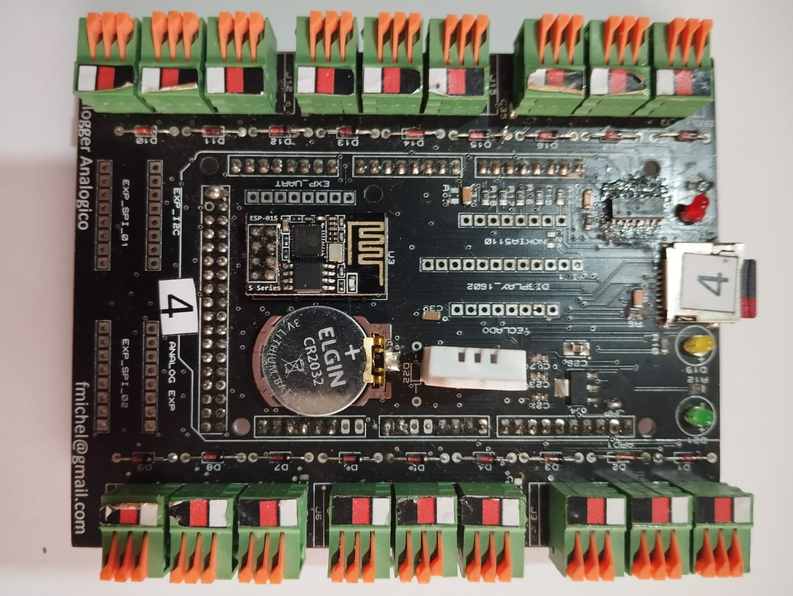
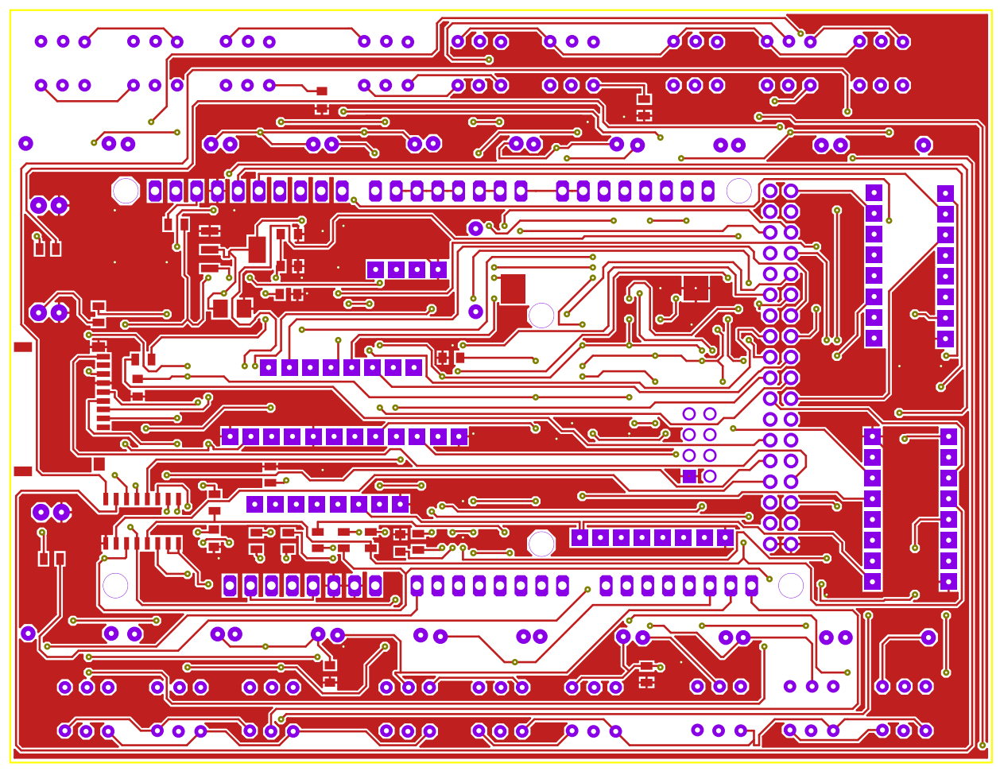
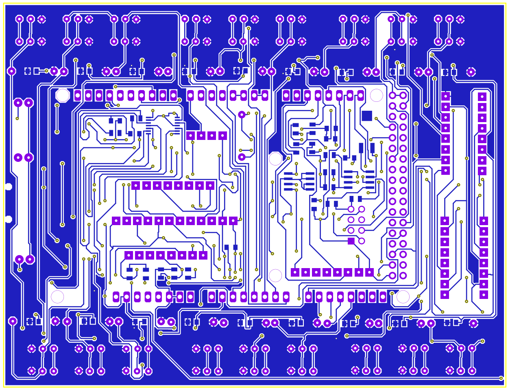
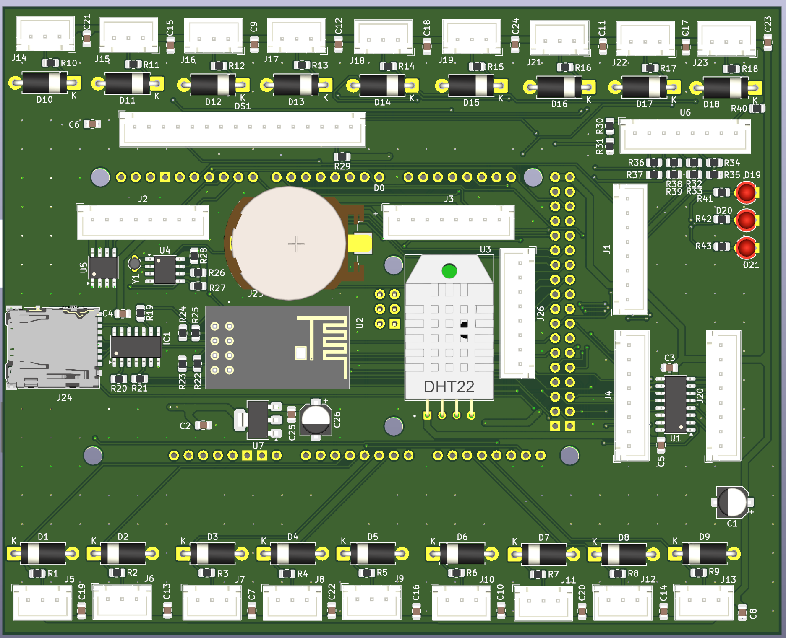
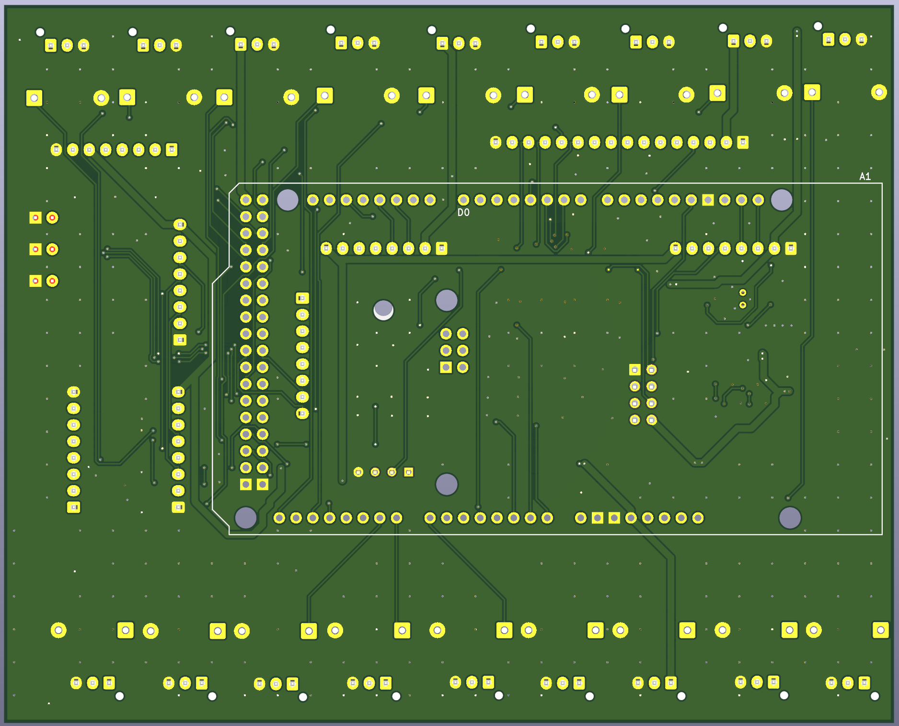
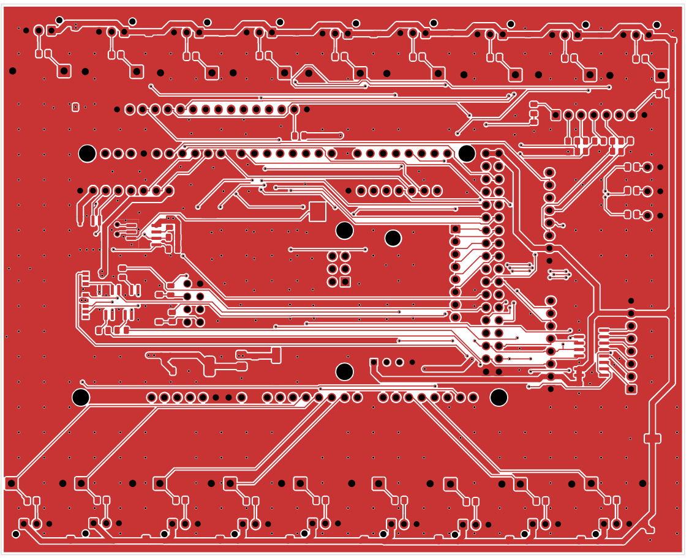
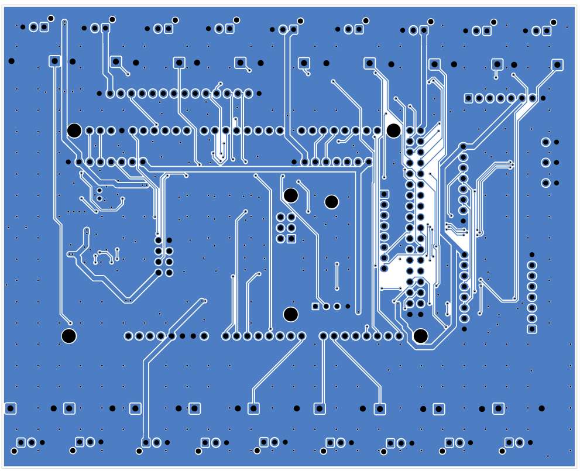

# 🌱 Datalogger de Umidade do Solo *FMD_Soil Moisture* – Hardware

## 📘 Visão Geral

 O **FMD_Soil Moisture** é um sistema autônomo para **monitoramento contínuo de umidade e temperatura do solo**, com armazenamento local e conectividade Wi-Fi e Serial-USB.

Projetado para aplicações agrícolas e experimentais, o sistema registra dados ambientais em longo prazo com alta confiabilidade e baixo custo.

O projeto é baseado em um **Arduino Mega 2560**, que coleta leituras de múltiplos sensores capacitivos de umidade do solo **HW-101 HW**, além de um sensor **DHT22** para temperatura e umidade do ar.

Os dados são registrados em **cartão microSD** e podem ser sincronizados via **módulo ESP-01 (ESP8266)** para monitoramento remoto.

## 🧩 Arquitetura Geral

### 🔹 Componentes Principais

| Módulo / Componente                                         | Função                            | Interface         | Observações                                                        |
| ----------------------------------------------------------- | --------------------------------- | ----------------- | ------------------------------------------------------------------ |
| **Arduino Mega 2560**                                       | Unidade de controle principal     | –                 | 16 canais analógicos nativos + expansão SPI                        |
| **Sensores de Umidade Capacitivos (HW-101 HW V1.2 / V2.0)** | Medição de umidade do solo        | Analógica (0–5 V) | 16 sensores diretos + 2 via MCP3008                                |
| **MCP3008**                                                 | Conversor A/D externo de 8 canais | SPI               | Expande entradas                                                   |
| **DHT22**                                                   | Temperatura e umidade do ar       | 1 fio (digital)   | Sensor ambiente                                                    |
| **ESP-01 (ESP8266)**                                        | Comunicação Wi-Fi                 | UART              | Upload de dados ou configuração remota                             |
| **RTC DS1307 + Bateria 3 V**                                | Relógio e calendário              | I²C               | Mantém data/hora durante desligamento                              |
| **MicroSD Card (SPI)**                                      | Armazenamento local               | SPI               | Indicadores de status via LEDs                                     |
| **LEDs de Status (3×)**                                     | Indicação do estado do SDCard     | GPIO              | - Sem cartão - Falha no cartão - Cartão OK (pisca ao gravar) |

## ⚙️ Recursos Adicionais (não implementados (no firmware) na versão atual)

| Recurso                | Componente              | Interface | Estado    |
| ---------------------- | ----------------------- | --------- | --------- |
| Memória EEPROM externa | 24C32WP                 | I²C       | Reservado |
| Display LCD 1602       | HD44780 (modo 4 bits)   | GPIO      | Reservado |
| Display 5110           | Nokia 5110              | SPI       | Reservado |
| Teclado                | Teclado matricial 4×4   | GPIO      | Reservado |
| Expansão ADC           | MCP3008 (canais livres) | SPI       | Reservado |

## 🔌 Conectores de Expansão

| Conector                | Interface               | Descrição                                          |
| ----------------------- | ----------------------- | -------------------------------------------------- |
| **Expansão A**          | I²C, 1× I/O, 2× PWM     | Compatível com sensores e atuadores externos       |
| **Expansão B**          | SPI, CS, 1× I/O, 1× PWM | Para módulos SPI adicionais                        |
| **Expansão C**          | SPI, CS, 1× I/O, 1× PWM | Similar à Expansão B                               |
| **Expansão D (Serial)** | TX/RX, 1× I/O, 2× PWM   | Conexão de módulos seriais ou periféricos externos |
| **Planejado**           | RS-232 e RS-485         | UART + controle de hardware                        |

## 🧾 Histórico de Versões do Hardware

| Versão   | Plataforma            | Descrição                                               | Status    |
| -------- | --------------------- | ------------------------------------------------------- | --------- |
| **V0.1** | Proteus (ISIS + ARES) | Primeira versão funcional do circuito e layout          | ✅ Testada |
| **V0.2** | KiCad 8               | Novo layout, roteamento otimizado e serigrafia revisada | 🔄 Atual  |

As **Figuras 1 e 2** apresentam a **versão V0.1** da placa, elaborada utilizando o *Proteus* (ISIS + ARES).  
Embora plenamente funcional, essa versão apresentou algumas limitações construtivas, como **trilhas incompletas que precisaram ser interligadas externamente por jumpers**, um **layout ainda imaturo** com **componentes montados em ambos os lados da placa** e **trilhas longas que se cruzam**, resultando em **pouca área disponível para o plano de terra**.  
Esses aspectos podem ser observados nas **Figuras 3 e 4**, que mostram os lados **superior** e **inferior** da placa.

<figure>
  

    
    
  

  <figcaption align="center"><b>Figura 1</b>: Placa V0.1 vista de cima.  <b> Figura 2</b>: – Placa V0.1 vista de baixo.</figcaption>
</figure>

<figure>
  

    
    
  

  <figcaption align="center"><b>Figura 3</b>: Placa V0.1 Top layer.  <b> Figura 4</b>: – Placa V0.1 Bottom layer.</figcaption>
</figure>>

A **versão V0.2**, desenvolvida no **KiCad**, manteve o mesmo circuito eletrônico da versão anterior, porém recebeu um **layout totalmente refeito**, com foco em otimização e robustez.  
Como ilustrado nas **Figuras 5 e 6**, o novo modelo 3D demonstra um **posicionamento mais racional dos componentes**, concentrados **em um único lado da placa**, com **trilhas mais curtas e diretas** e **ampla área para planos de terra em ambas as faces**.  
As **Figuras 7 e 8** evidenciam também a **costura entre planos de terra**, que contribui para **melhorar a imunidade a ruídos** e **reduzir interferências eletromagnéticas (EMI)**, tornando o hardware mais confiável para uso em ambientes agrícolas sujeitos a variações de umidade e ruído elétrico.

<figure>
  

    
    
  

  <figcaption align="center"><b>Figura 5</b>: Placa V0.2 vista de cima, modelo 3D.  <b> Figura 6</b>: – Placa V0.2 vista de baixo, modelo 3D.</figcaption>
</figure>

<figure>
  

    
    
  

  <figcaption align="center"><b>Figura 7</b>: Placa V0.2 Top layer.  <b> Figura 8</b>: – Placa V0.2 Bottom layer.</figcaption>
</figure>>

## 🧮 Especificações Técnicas

- **Alimentação:** 7 – 12 V DC
- **Consumo típico:** ~200 mA (sem Wi-Fi ativo)
- **Número total de canais de umidade:** 18
- **Resolução ADC (interna):** 10 bits
- **Resolução ADC (externa):** 10 bits (MCP3008)
- **Período de amostragem:** configurável (ex.: 5 s a 10 min)
- **Armazenamento:** microSD FAT32 (até 32 GB)
- **Conectividade:** Wi-Fi (ESP-01), Serial USB

## 🧰 Próximas Melhorias

- Implementação do barramento **RS-485** para rede de sensores.
- Inclusão de **display LCD/Nokia** para feedback local.
- Sistema de **menus via teclado matricial**.
- Adição de **EEPROM 24C32WP** para parâmetros persistentes.

## 📁 Estrutura de Pastas (Hardware)

## 📜 Licença

Este projeto é distribuído sob a licença **MIT**, permitindo uso, modificação e distribuição com atribuição ao autor.

---

**Autor:** Fabrício Michel Denes  
**Repositório:** [github.com/fabriciomicheldenes/FMD_MoistureDatalogger](https://github.com/fabriciomicheldenes/FMD_MoistureDatalogger)